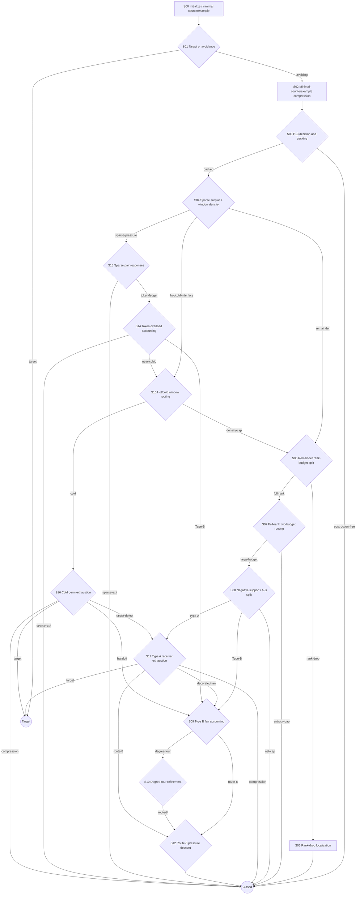
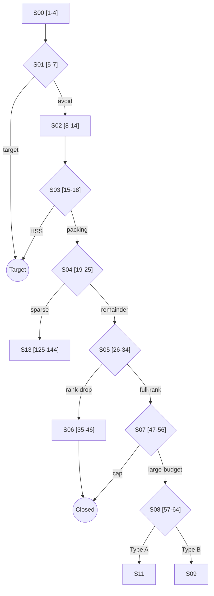
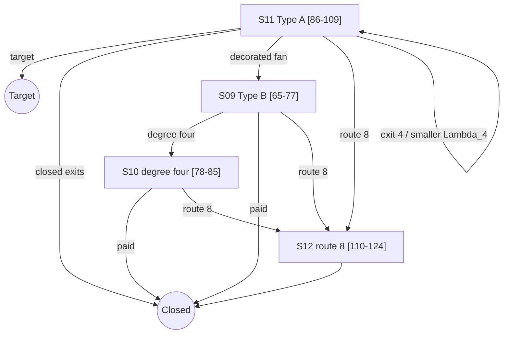
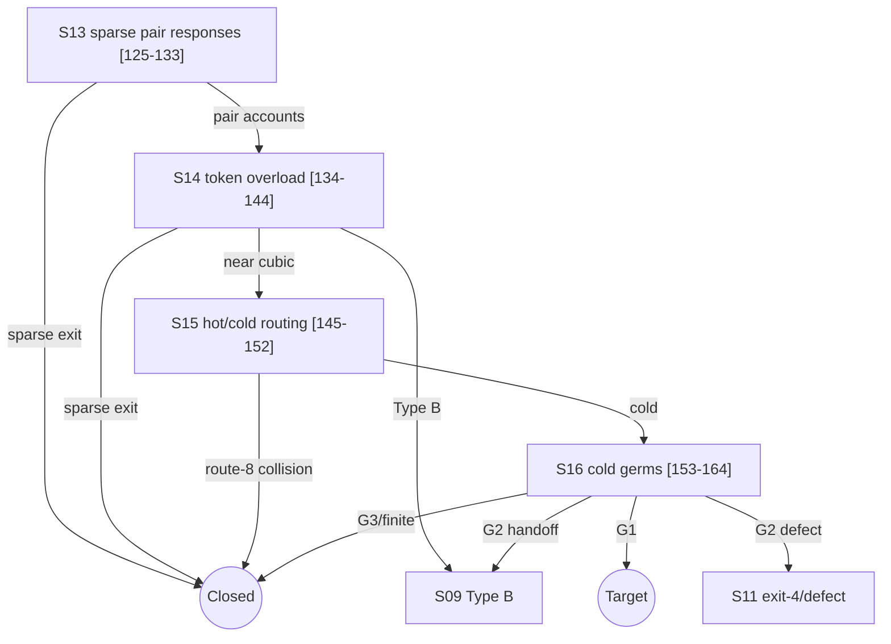

# Erdos--Gyarf\u00e1s Strategy DAG Specification

## 1. Purpose

This document translates the proof architecture in
`proofs/erdos_64_eg/erdos_64_proof.tex` and its Lean node realization into a
Hypostructure strategy DAG. It does not change the mathematics, add a new
implication, or prescribe node-shaped application code.

The paper nodes are traceability identifiers only. A DAG vertex is a cohesive,
reusable strategy built from CTs. Each vertex consumes the literal predecessor
residual and the accumulated ledger. Core owns composition, routing, joins,
early target closure, and construction of the total residual.

## 2. DAG Conventions

### 2.1 Values carried by the runner

- **Problem input**: the registered finite graph, baseline hypothesis, and
  registered target.
- **Residual**: the exact active mathematical case that remains after a
  strategy has run.
- **Ledger**: append-only certified output from all strategies on the active
  route. A later strategy queries the ledger; it does not copy earlier data.
- **Target terminal**: a target witness accepted by the registered target.
- **Closed terminal**: an impossible residual, discharged by contradiction,
  minimality, compression, or a registered external theorem.
- **Continuation terminal**: an exact residual consumed by another strategy.
- **Join**: Core's dependent union of exhaustive branch outputs. It does not
  merge or reconstruct payloads.

### 2.2 Edge notation

The machine-oriented edge lists below use:

```text
source --label--> destination
source --target--> TARGET
source --closed--> CLOSED
source --residual--> RESIDUAL(name)
```

An edge label names a constructor of the source strategy's exhaustive output.
Feedback edges are legal only when the source strategy certifies the displayed
well-founded decrease.

### 2.3 Strategy identifiers

| ID | Reusable strategy pattern | Paper nodes |
|---|---|---:|
| `S00` | Problem initialization and counterexample reduction | 1--4 |
| `S01` | Target-or-avoidance return scan | 5--7 |
| `S02` | Minimal-counterexample compression | 8--14 |
| `S03` | Induced-obstruction decision and maximal packing | 15--18 |
| `S04` | Sparse-surplus and window-density routing | 19--25 |
| `S05` | Remainder support and rank-budget split | 26--34 |
| `S06` | Rank-drop localization and compression | 35--46 |
| `S07` | Full-rank entropy and two-budget routing | 47--56 |
| `S08` | Negative-support localization and surplus split | 57--64 |
| `S09` | Type B fan and incidence accounting | 65--77 |
| `S10` | Degree-four Type B refinement | 78--85 |
| `S11` | Type A receiver exhaustion | 86--109 |
| `S12` | Route-8 carrier and pressure descent | 110--124 |
| `S13` | Sparse pair activation and response classification | 125--133 |
| `S14` | Capacity-token overload accounting | 134--144 |
| `S15` | Hot/cold window routing | 145--152 |
| `S16` | Cold first-failure and bounded-germ exhaustion | 153--164 |

These are strategy boundaries, not new mathematical claims. Each strategy is
the composition of the CTs already used by the corresponding paper block.

## 3. Top-Level DAG



The arrows from `S14` and `S15` are semantic joins into already declared
residual types. They do not restart those strategies with reconstructed data.

## 4. Strategy Specifications

### S00 -- Problem initialization and counterexample reduction `[1--4]`

**Pattern:** initialization followed by exhaustive target/counterexample
reduction and lexicographic minimal selection.

**Input:** registered EG problem input.

**Ledger output:** current finite graph, baseline minimum-degree certificate,
target-avoidance certificate on the counterexample branch, and the selected
lexicographically minimal counterexample.

**Terminals:**

- `notCounterexample`: closed by the registered target/counterexample split;
- `minimalCounterexample`: continuation to `S01`.

### S01 -- Target-or-avoidance return scan `[5--7]`

**Pattern:** target avoidance plus ordered witness scan.

**CT composition:** target algebra -> CT1 Mersenne-return decision -> target
realization or exact avoiding successor.

**Input:** `minimalCounterexample` residual from `S00`.

**Ledger queries:** current graph and registered target algebra.

**Terminals:** `powerOfTwoCycle -> TARGET`; `noMersenneReturn -> S02`.

### S02 -- Minimal-counterexample compression `[8--14]`

**Pattern:** certified reduction and response classification.

**CT composition:** proper-core exclusion -> CT2 deletion criticality ->
high-degree independence -> CT3 boundary profile and context response ->
replacement -> hereditary uncompressibility.

**Input:** literal avoiding residual from `S01`.

**Ledger output:** no proper minimum-degree-three core, edge-deletion
criticality, independent high-degree set, boundary profile,
context-universality, replacement law, and proper-support uncompressibility.

**Terminal:** `uncompressibleAvoiding -> S03`.

### S03 -- Induced obstruction and maximal packing `[15--18]`

**Pattern:** target-or-avoidance followed by maximal packing and finite response
classification.

**CT composition:** CT1 induced-`P13` decision -> HSS target closure on the
`P13`-free branch -> CT12 maximal disjoint induced-`P13` packing -> CT10 exact
attachment-label table.

**Input:** uncompressible avoiding residual from `S02`.

**Ledger output:** selected packing, exact induced remainder, maximality and
saturation, the 399-row discrete table, relations `C_s`, and curvature
coordinate `Omega_2`.

**Terminals:** `hssCycle -> TARGET`; `packedLabelled -> S04`.

### S04 -- Sparse surplus and window-density routing `[19--25]`

**Pattern:** rank/budget split, finite-table accounting, and hot/cold
filtration.

**Input:** packed and labelled residual from `S03`.

**Ledger queries:** selected packing, label table, degree-surplus observable,
and problem-owned constants.

**Outputs:**

- `nonNearCubic`: exact sparse-pressure residual to `S13` (`[20]->[125]`);
- `windowEntropyOverflow`: closed entropy-overflow terminal `[23]`;
- `densityCap`: certified window-density bound and hot/cold interface to `S15`;
- `largeRemainder`: Residual A, with exact support partition and componentwise
  induced-`P13` avoidance, to `S05`.

The density and hot/cold outputs share the same packing ledger. No packing is
recomputed.

### S05 -- Remainder support and rank-budget split `[26--34]`

**Pattern:** support localization plus rank/budget dichotomy.

**Input:** Residual A from `S04`.

**CT composition:** internal-three-core exclusion -> positive-deficiency and
external-incidence capacity ledger -> wedge lower bound -> target-relative
curvature rank -> exhaustive rank-drop split.

**Ledger output:** exact remainder, component schedule, deficiency and surplus
accounts, incidence bound, wedge count, and target-relative rank.

**Terminals:** `rankDrop -> S06`; `fullRank -> S07`.

### S06 -- Rank-drop localization and compression `[35--46]`

**Pattern:** response classification, support localization, and certified
compression.

**Input:** rank-reducing dependence from `S05`.

**Routing:** outside-context failure closes as target defect; a proper
target-complete representative closes by minimality; otherwise enlarge to a
connected support, split proper versus whole support, and apply respectively
smearing/compression or whole-graph delocalization plus the `1--3` repair
identity.

**Terminals:** every exhaustive leaf is target, target defect, compression, or
global profile contradiction. The strategy has no continuation residual.

### S07 -- Full-rank entropy and two-budget routing `[47--56]`

**Pattern:** rank-budget accounting over the full-rank residual.

**Input:** full-rank residual from `S05`.

**Ledger output:** forced curvature cost, exact remainder state count and
entropy, high-entropy accounting, remaining-budget comparison, and net
deficiency cap.

**Terminals:**

- `highEntropy` and `smallRemainingBudget`: entropy-cap closure `[54]`;
- `largeBudget`: Residual C with `Delta_net < 1/4`, to `S08`.

### S08 -- Negative-support localization and A/B split `[57--64]`

**Pattern:** signed budget decision, connected support localization, and
exhaustive support-profile dichotomy.

**Input:** large-budget net-cap residual from `S07`.

**CT composition:** name net charge -> sign split -> close nonnegative case
against strict net cap -> CT11 connected negative-support selection ->
high-degree-surplus split.

**Terminals:** `nonnegative -> CLOSED`; `noHighSurplus -> S11` (Type A);
`highSurplus -> S09` (Type B).

Type A and Type B are names for these two output constructors, not Core types.

### S09 -- Type B fan and incidence accounting `[65--77]`

**Pattern:** response classification plus capacity and incidence accounting.

**Inputs:** either the Type B residual from `S08` or the decorated-fan handoff
from `S11`. Both enter a common registered fan-envelope residual.

**CT composition:** independent-center/cubic-neighbour profile -> degree split
-> CT10 incident-port classification -> CT9 compatibility/capacity -> CT7
response comparison -> CT5 shoulder assignment -> certificate-marked fan cap
-> CT14 B1/B2 mass ledger and bridge reduction.

**Terminals:**

- `degreeFour -> S10`;
- `minimalOverlap` joins the fan-mass accounting path;
- `paidOutsideRoute8 -> CLOSED`;
- `route8 -> S12`.

### S10 -- Degree-four Type B refinement `[78--85]`

**Pattern:** finite response profile followed by capacity-ledger refinement.

**Input:** exact degree-four constructor from `S09`.

**Ledger output:** center surplus, closed-neighbour count `c`, local deficit,
certificate status, and B2 disjointness result.

**Terminals:** certificate-closed or B2-paid leaves close outside route 8;
overlap and missing-certificate leaves join the fan-mass route; any surviving
route-8 residual goes to `S12`.

### S11 -- Type A receiver exhaustion `[86--109]`

**Pattern:** support localization, ordered exhaustion, response classification,
and target-or-avoidance.

**Input:** no-high-surplus connected negative support from `S08`.

**CT composition:** Type A support profile -> bounded subcubic support -> raw
receiver thresholds -> receiver-load split -> `3/7/11` capacity accounting or
ordered visible-return scan -> exits 1--7 -> route-8 residual.

**Terminals:**

- unsaturated receiver accounting closes at `[92]`;
- exits 1 and 2 produce `TARGET`;
- exits 3, 5, and 6 close by collision, compression, or delocalization;
- exit 4 peels one target-defective load and returns to the receiver split with
  strictly smaller `Lambda_4`;
- exit 7 produces the decorated-fan residual consumed by `S09`;
- exit 8 produces the route-8 residual consumed by `S12`.

The feedback edge is:

```text
S11.exit4 -- Lambda_4 decreases --> S11.receiverSplit
```

### S12 -- Route-8 carrier and pressure descent `[110--124]`

**Pattern:** support localization, capacity accounting, and well-founded
target-defect peeling.

**Inputs:** route-8 residuals from `S09`, `S10`, or `S11`.

**CT composition:** global squeeze -> route-8 burden -> large-budget deficit ->
canonical minimal carrier core -> essential/private-carrier classification ->
capacity upper/lower squeeze -> two-carrier pressure descent.

**Terminals:** zero/one-essential-core entries route to already declared exits
4--7; no-two-carrier entries close by the incompatible pressure bounds; a
two-carrier entry undergoes finite exit-4 peeling and its terminal survivor is
closed by the local two-carrier no-go theorem.

The descent measure is the finite target-defect load `Lambda_4`.

### S13 -- Sparse pair activation and responses `[125--133]`

**Pattern:** ordered witness scan and finite response classification.

**Input:** non-near-cubic residual from `S04`.

**CT composition:** sparse envelope -> exact excess-port extraction ->
canonical activation -> full active family -> CT15 canonical pair scan ->
free/blocked response split.

**Terminals:** sparse surplus exits close; free pairs enter the common coupled
budget through their entropy account; blocked pairs continue to `S14` with a
canonical blocker.

### S14 -- Capacity-token overload accounting `[134--144]`

**Pattern:** capacity ledger, coupled overload, and homogeneous closed-code
exhaustion.

**Input:** free-pair account and blocked-pair residuals from `S13`, joined over
the same active pair schedule.

**CT composition:** canonical blocker ledger -> exact window-join pressure ->
25-role capacity-token partition -> coupled excess split -> token-class route
-> deterministic matching/star audit -> fixed homogeneous response classifier.

**Terminals:**

- no coupled overload produces the near-cubic spine consumed by `S15`;
- overload in each of the window, remainder, and primitive token classes joins
  the common bottleneck discharge;
- bottleneck outputs are sparse exit, Type B fan data to `S09`, or near-cubic
  spine to `S15`.

### S15 -- Hot/cold window routing `[145--152]`

**Pattern:** threshold split, rank-budget split, and support filtration.

**Input:** the density interface from `S04` or near-cubic spine from `S14`.

**CT composition:** `theta < 1/78` split -> route-8 private-carrier closure or
live-hot entropy split -> density cap or unpaid cold family -> ambient-cubic
filter -> cold-stub excess ledger.

**Terminals:** route-8 collision closes; density-cap output rejoins the
remainder/rank pipeline at its matching residual; cold-stub excess continues to
`S16`.

### S16 -- Cold first-failure and bounded-germ exhaustion `[153--164]`

**Pattern:** ordered first-failure scan, response classification, and closed
code exhaustion.

**Input:** exact cold family, cubic filter, and stub ledger from `S15`.

**Internal strategy refinement represented by Lean nodes `[158--164]`:**

1. certify the bounded scale (`[158]`);
2. choose an admissible candidate from the residual-owned schedule (`[159]`);
3. split the next semantic clause (`[160]`);
4. append its certified evidence or exact residual (`[161--162]`);
5. package the successful bounded germ and terminal finite class (`[163--164]`).

**Terminals:** G1 yields `TARGET`; G2 routes to target defect, exit 4, or an
existing Type B handoff; G3/finite-table equality closes by target-complete
compression. All local F1--F5 and D4--D7 alternatives remain inside this
strategy's exhaustive dependent output rather than becoming application-level
routing code.

## 5. Panel-Level DAGs

### Parts I--V: common spine and A/B split



### Parts VI--IX: Type B, Type A, and route 8



### Parts X--XI: sparse pressure and hot/cold continuation



## 6. Machine-Oriented Edge List

```text
S00.minimalCounterexample --> S01
S00.notCounterexample --> CLOSED
S01.target --> TARGET
S01.avoiding --> S02
S02.uncompressibleAvoiding --> S03
S03.hssCycle --> TARGET
S03.packedLabelled --> S04
S04.nonNearCubic --> S13
S04.windowEntropyOverflow --> CLOSED
S04.densityInterface --> S15
S04.largeRemainder --> S05
S05.rankDrop --> S06
S05.fullRank --> S07
S06.* --> CLOSED
S07.entropyCap --> CLOSED
S07.largeBudget --> S08
S08.nonnegative --> CLOSED
S08.noHighSurplus --> S11
S08.highSurplus --> S09
S09.degreeFour --> S10
S09.paidOutsideRoute8 --> CLOSED
S09.route8 --> S12
S10.paidOutsideRoute8 --> CLOSED
S10.route8 --> S12
S11.target --> TARGET
S11.closedExit --> CLOSED
S11.exit4 --decreases Lambda_4--> S11
S11.decoratedFan --> S09
S11.route8 --> S12
S12.* --> CLOSED
S13.sparseExit --> CLOSED
S13.freePair --> S14
S13.blockedPair --> S14
S14.sparseExit --> CLOSED
S14.typeBFan --> S09
S14.nearCubic --> S15
S15.route8Collision --> CLOSED
S15.densityCap --> S05
S15.coldStubExcess --> S16
S16.target --> TARGET
S16.targetDefect --> S11
S16.exit4 --> S11
S16.typeBHandoff --> S09
S16.compression --> CLOSED
```

## 7. Complete Node Traceability

| Paper/Lean nodes | Strategy | Role in the strategy DAG |
|---:|---|---|
| 1--4 | `S00` | Input, counterexample split, minimal selection |
| 5--7 | `S01` | Return target-or-avoidance |
| 8--14 | `S02` | Criticality, boundary responses, replacement |
| 15--18 | `S03` | Induced-`P13` split, packing, discrete labels |
| 19--25 | `S04` | Surplus and density routes; Residual A |
| 26--34 | `S05` | Remainder deficiency, wedge rank, Residual B |
| 35--46 | `S06` | Rank-drop support/compression closure |
| 47--56 | `S07` | Full-rank entropy and Residual C |
| 57--64 | `S08` | Net-charge localization and Type A/B split |
| 65--77 | `S09` | Type B fan, B1/B2 ledger, route 8 |
| 78--85 | `S10` | Degree-four Type B refinement |
| 86--109 | `S11` | Type A receiver loads and exits 1--8 |
| 110--124 | `S12` | Route-8 carrier pressure and no-go closure |
| 125--133 | `S13` | Sparse active pairs and blocker response |
| 134--144 | `S14` | Token capacities and homogeneous overload |
| 145--152 | `S15` | Hot/cold threshold, mass, and stub excess |
| 153--157 | `S16` | First failure and G1/G2/G3 classification |
| 158--164 | `S16` internal | Bounded scale, candidate, semantic split, evidence/residual, package |

This partition covers every numbered paper vertex and every standalone
Hypostructure node file currently extending the paper's final cold block.

## 8. Framework Ownership Rules

The eventual Lean DAG must satisfy the following architecture:

1. The EG application declares only the registered problem and the strategy
   DAG.
2. Every strategy consumes the exact predecessor residual and queries the
   accumulated ledger.
3. Core creates all ledger extensions and dependent branch unions.
4. Graph specializes generic support, path, incidence, and finite-response
   operations; it does not own EG constants or branch names.
5. EG-specific constants and discrete tables remain problem-owned inputs.
6. Type A, Type B, Residual A/B/C, and route 8 are names for typed DAG outputs,
   not framework primitives.
7. No strategy copies a prior payload, reconstructs a graph/support, manually
   selects a branch, or manufactures a terminal.
8. A target terminal must contain a witness accepted by the registered target;
   every other terminal remains a literal certified residual or is closed by
   its stated contradiction.

## 9. Translation Validation Checklist

- [x] All eleven paper diagram panels are represented.
- [x] Every paper node `[1]--[157]` has one strategy owner.
- [x] Lean refinement nodes `[158]--[164]` are represented inside the cold
  first-failure strategy.
- [x] Cross-panel continuations are explicit.
- [x] The Type A exit-4 feedback edge has the measure `Lambda_4`.
- [x] The Type A exit-7 handoff joins the common Type B input.
- [x] All route-8 producers join the common pressure strategy.
- [x] Free and blocked sparse-pair branches join before coupled accounting.
- [x] Window, remainder, and primitive overload classes join the same
  homogeneous bottleneck discharge.
- [x] Target, closed, and continuation terminals are distinguished.
- [x] No node-level routing or manual ledger construction is part of the DAG
  architecture.
