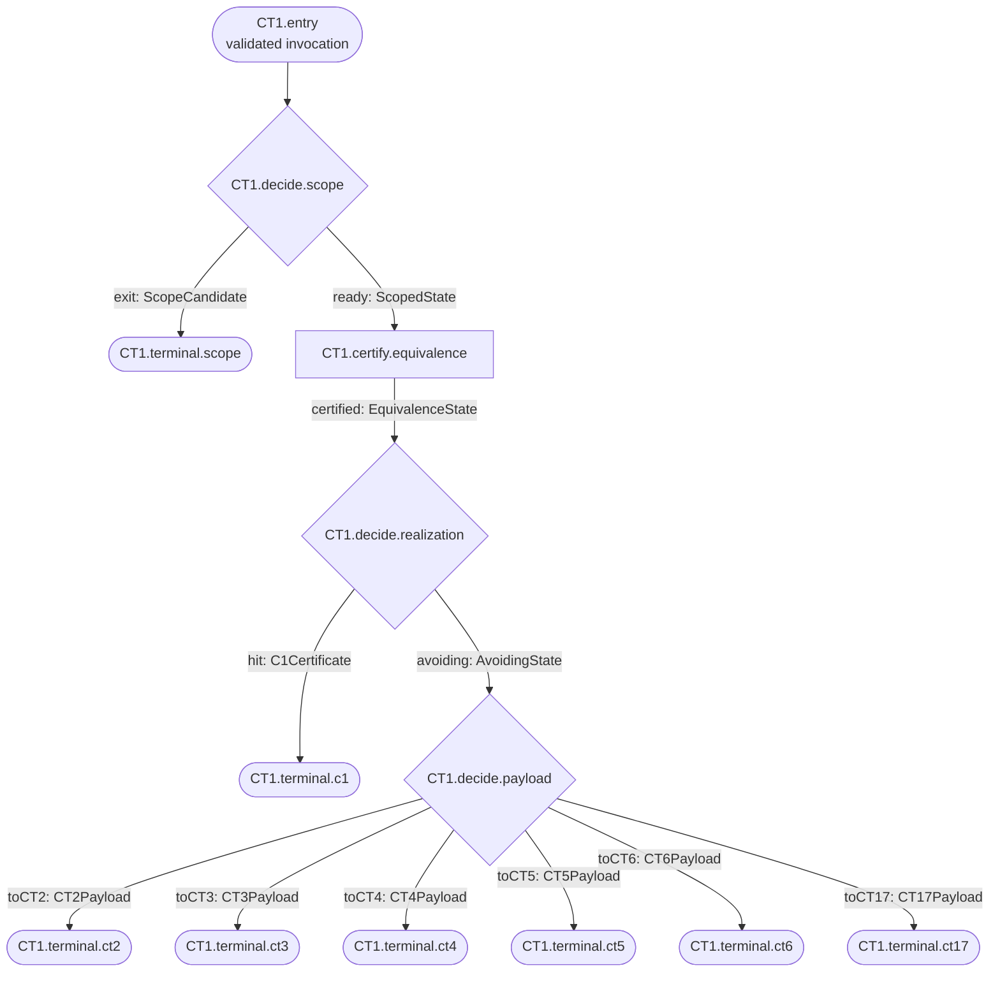

```mermaid
flowchart TD
  E([CT1.entry<br/>validated invocation]) --> S{CT1.decide.scope}
  S -- exit: ScopeCandidate --> TS([CT1.terminal.scope])
  S -- ready: ScopedState --> Q[CT1.certify.equivalence]
  Q -- certified: EquivalenceState --> R{CT1.decide.realization}
  R -- hit: C1Certificate --> C1([CT1.terminal.c1])
  R -- avoiding: AvoidingState --> P{CT1.decide.payload}
  P -- toCT2: CT2Payload --> T2([CT1.terminal.ct2])
  P -- toCT3: CT3Payload --> T3([CT1.terminal.ct3])
  P -- toCT4: CT4Payload --> T4([CT1.terminal.ct4])
  P -- toCT5: CT5Payload --> T5([CT1.terminal.ct5])
  P -- toCT6: CT6Payload --> T6([CT1.terminal.ct6])
  P -- toCT17: CT17Payload --> T17([CT1.terminal.ct17])
```
