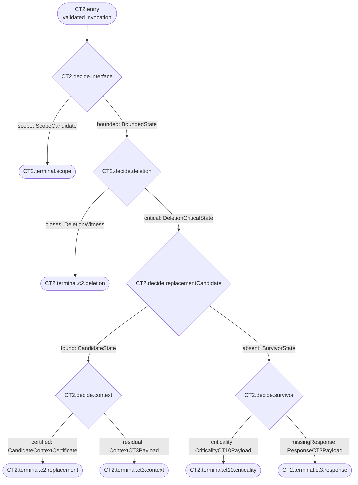

```mermaid
flowchart TD
  E([CT2.entry<br/>validated invocation]) --> I{CT2.decide.interface}
  I -- scope: ScopeCandidate --> TS([CT2.terminal.scope])
  I -- bounded: BoundedState --> D{CT2.decide.deletion}
  D -- closes: DeletionWitness --> TD([CT2.terminal.c2.deletion])
  D -- critical: DeletionCriticalState --> R{CT2.decide.replacementCandidate}
  R -- found: CandidateState --> C{CT2.decide.context}
  R -- absent: SurvivorState --> S{CT2.decide.survivor}
  C -- certified: CandidateContextCertificate --> TR([CT2.terminal.c2.replacement])
  C -- residual: ContextCT3Payload --> TC([CT2.terminal.ct3.context])
  S -- criticality: CriticalityCT10Payload --> T10([CT2.terminal.ct10.criticality])
  S -- missingResponse: ResponseCT3Payload --> TM([CT2.terminal.ct3.response])
```
