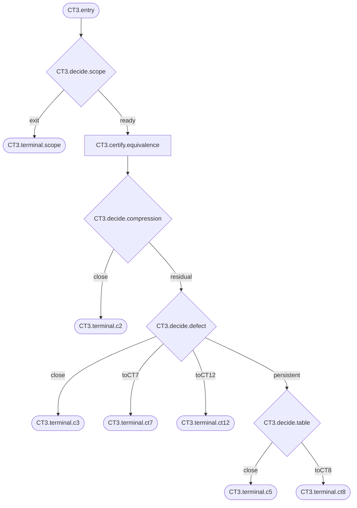

```mermaid
flowchart TD
  E([CT3.entry]) --> S{CT3.decide.scope}
  S -- exit --> TS([CT3.terminal.scope])
  S -- ready --> Q[CT3.certify.equivalence]
  Q --> C{CT3.decide.compression}
  C -- close --> C2([CT3.terminal.c2])
  C -- residual --> D{CT3.decide.defect}
  D -- close --> C3([CT3.terminal.c3])
  D -- toCT7 --> T7([CT3.terminal.ct7])
  D -- toCT12 --> T12([CT3.terminal.ct12])
  D -- persistent --> F{CT3.decide.table}
  F -- close --> C5([CT3.terminal.c5])
  F -- toCT8 --> T8([CT3.terminal.ct8])
```
