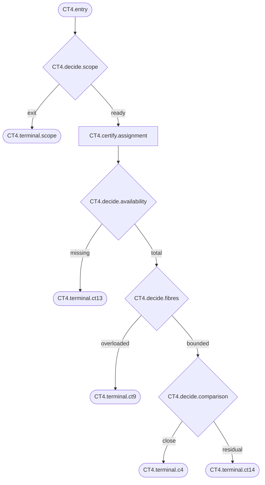

```mermaid
flowchart TD
  E([CT4.entry]) --> S{CT4.decide.scope}
  S -- exit --> TS([CT4.terminal.scope])
  S -- ready --> A[CT4.certify.assignment]
  A --> V{CT4.decide.availability}
  V -- missing --> T13([CT4.terminal.ct13])
  V -- total --> F{CT4.decide.fibres}
  F -- overloaded --> T9([CT4.terminal.ct9])
  F -- bounded --> C{CT4.decide.comparison}
  C -- close --> C4([CT4.terminal.c4])
  C -- residual --> T14([CT4.terminal.ct14])
```
