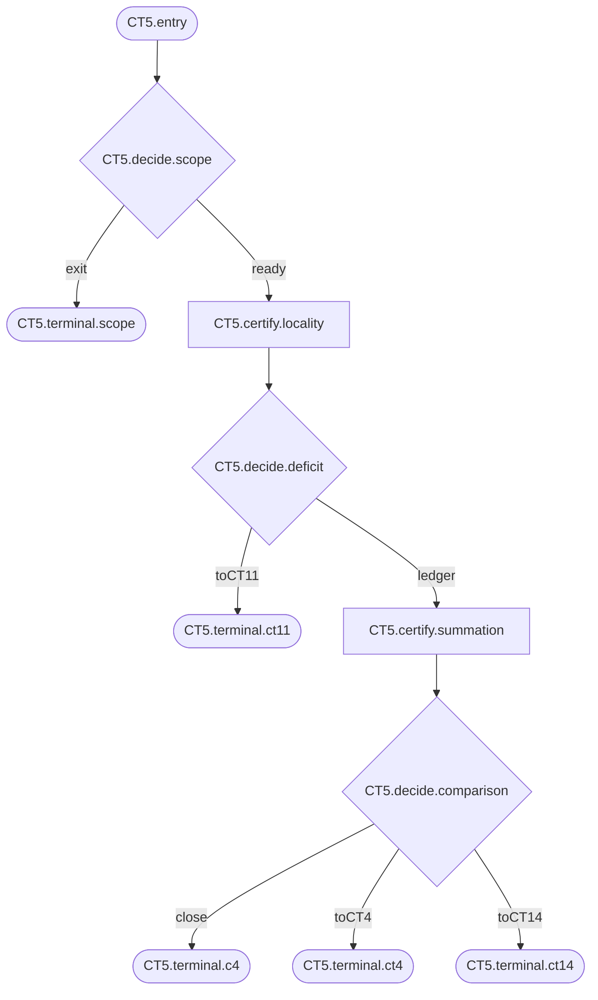

```mermaid
flowchart TD
  E([CT5.entry]) --> S{CT5.decide.scope}
  S -- exit --> TS([CT5.terminal.scope])
  S -- ready --> L[CT5.certify.locality]
  L --> D{CT5.decide.deficit}
  D -- toCT11 --> T11([CT5.terminal.ct11])
  D -- ledger --> U[CT5.certify.summation]
  U --> C{CT5.decide.comparison}
  C -- close --> C4([CT5.terminal.c4])
  C -- toCT4 --> T4([CT5.terminal.ct4])
  C -- toCT14 --> T14([CT5.terminal.ct14])
```
